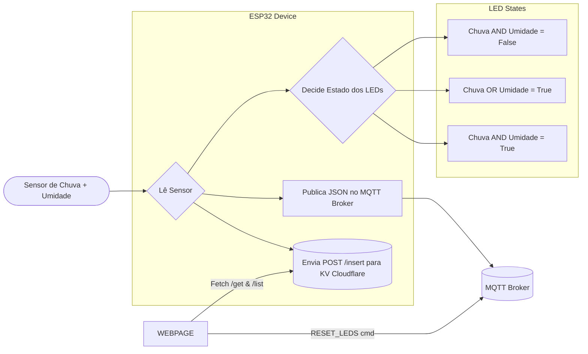

# IOT_TRAB_01

ALUNO:
GABRIEL HENRIQUE FERNANDES TELLES

## 📊 Fluxo do Projeto ESP32

## 📊 Relatório do Projeto ESP32

A arquitetura do dispositivo é composta por um ESP32 conectado a 3 LEDs (vermelho, amarelo e verde) e a 2 sensores (chuva e umidade).

🔹 Estrutura Física

Sensores: Capturam as variáveis de chuva e umidade em tempo real.

LEDs Indicadores:

Vermelho: Indica condição seca (sem chuva e sem umidade).

Amarelo: Indica condição intermediária (chuva OU umidade detectada).

Verde: Indica condição crítica (chuva E umidade detectadas).

🔹 Lógica de Funcionamento

O ESP32 realiza leituras intermitêntes.

A cada leitura, o dispositivo processa as condições lógicas e define o LED ativo:

chuva == false AND umidade == false → LED Vermelho ligado.

chuva == true OR umidade == true → LED Amarelo ligado.

chuva == true AND umidade == true → LED Verde ligado.

O resultado é publicado via MQTT Broker no formato JSON, permitindo integração em tempo real com o dashboard localizado no código HTML.

Simultaneamente, os dados são postados em um banco de dados KV no Cloudflare, por meio do método POST.

🔹 Integração com Cloudflare KV

POST /insert → Insere uma nova leitura de sensores no banco.

GET /list → Retorna todas as leituras armazenadas (histórico).

GET /last → Retorna a última leitura registrada.

🔹 Dashboard Web

Foi desenvolvida uma interface simples em HTML/JS, que consome os dados do banco e exibe:

Histórico de leituras via GET /list.

Última leitura via GET /last.

Botão Reset LEDs, que envia um comando ao MQTT Broker (RESET_LEDS cmd), fazendo todos os LEDs piscarem simultaneamente como teste de funcionamento.

